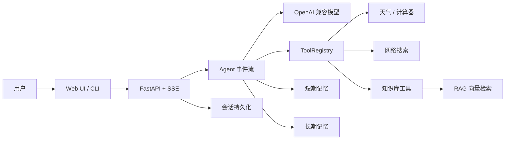

# 智能多工具助手

智能多工具助手是一个基于 OpenAI 兼容模型 API 的多工具智能体项目。它把大模型对话、function calling、工具注册、短期记忆、长期记忆、本地知识库检索和网页端会话管理整合在一起，适合用于构建个人助理、知识库问答助手或可扩展的智能体原型。

项目提供命令行和 Web 两种使用方式。Web 端支持多会话管理、流式回复、工具调用过程展示、引用来源展示、长期记忆查看和本地文档上传。

## 项目亮点

- **自研 Agent 事件流主循环**：统一编排模型回复、工具调用、RAG 预检索、记忆注入和 SSE 流式输出。
- **Function Calling 工具平台**：通过 `ToolRegistry` 管理工具 schema、可用性、分发和异常兜底，新增工具只需实现统一接口。
- **RAG 知识库问答**：支持本地文档切块、embedding 入库、余弦相似度检索、来源展示和“知识库未提及”防幻觉策略。
- **双层记忆系统**：短期记忆自动压缩历史上下文，长期记忆跨会话持久化用户事实，并支持更新和删除。
- **可视化 Web 工作台**：三栏界面展示多会话、流式回复、工具调用、引用来源、长期记忆和能力状态。
- **工程化保障**：提供配置化模型接入、搜索与 embedding 降级策略、会话落盘、接口测试和核心模块单元测试。

## 架构概览



更详细的模块说明见 [docs/architecture.md](docs/architecture.md)，RAG 效果验证见 [docs/rag-verification.md](docs/rag-verification.md)，简历表述与面试讲解参考见 [docs/resume.md](docs/resume.md)。

## 功能特性

- **流式智能体对话**：`agent.py` 负责主循环，按事件流输出 token、工具调用、引用来源和完成状态。
- **OpenAI 兼容模型接入**：`llm.py` 封装聊天、流式响应和 embedding 能力，可对接 OpenAI 或兼容服务。
- **可扩展工具系统**：`tools/registry.py` 统一注册和分发工具，当前内置天气查询、计算器、网络搜索和本地知识库检索。
- **网络搜索工具**：`tools/web_search.py` 支持博查 Web Search API；未配置 API Key 或请求失败时会回退到示例结果，保证流程可用。
- **本地知识库 RAG**：`rag/` 负责文档切块、向量入库和相似度检索；`tools/knowledge_base.py` 将检索能力包装为模型工具，并在回答中返回来源。
- **记忆系统**：短期记忆会压缩较早对话，长期记忆会把用户稳定事实和偏好持久化到 `data/memory_store.json`，并支持更新和删除记忆。
- **多会话持久化**：`memory/conversation_store.py` 将会话记录保存到 `data/conversations/`，服务重启后仍可恢复历史上下文。
- **Web 管理界面**：`frontend/index.html` 提供三栏界面，包括会话列表、对话区和工具/来源/记忆仪表栏。
- **优雅降级**：单个工具异常、embedding 服务不可用或搜索接口未配置时，项目会尽量使用本地兜底逻辑保持主流程可运行。

## 技术栈

- Python 3.10+
- FastAPI / Uvicorn
- OpenAI Python SDK
- NumPy
- 原生 HTML / CSS / JavaScript
- Pytest

## 项目结构

```text
.
├── agent.py                  # 智能体主循环与事件流
├── factory.py                # 组装 LLM、工具、记忆和 Agent
├── llm.py                    # OpenAI 兼容模型客户端
├── main.py                   # 命令行入口
├── server.py                 # FastAPI 后端与静态前端托管
├── config.py                 # 环境变量读取
├── frontend/
│   └── index.html            # Web 对话界面
├── tools/                    # 工具定义、注册和调度
├── memory/                   # 短期记忆、长期记忆、会话持久化
├── rag/                      # 文档切块、向量库与检索入库
├── docs/
│   ├── architecture.md       # 架构说明
│   └── rag-verification.md   # RAG 验证清单
├── data/
│   ├── docs/                 # 本地知识库种子文档
│   ├── conversations/        # 多会话历史
│   └── memory_store.json     # 长期记忆数据
└── tests/                    # 单元测试
```

## 快速开始

### 1. 安装依赖

```bash
pip install -r requirements.txt
```

### 2. 配置环境变量

复制 `.env.example` 为 `.env`，并填写你的模型服务配置：

```bash
cp .env.example .env
```

核心配置项如下：

```env
OPENAI_API_KEY=sk-xxxx
OPENAI_BASE_URL=https://api.openai.com/v1
CHAT_MODEL=gpt-4o-mini
EMBEDDING_MODEL=text-embedding-3-small
LOCAL_EMBEDDING_FALLBACK=true

WEB_SEARCH_API_KEY=
WEB_SEARCH_ENDPOINT=https://api.bochaai.com/v1/web-search
USER_ID=local
```

`WEB_SEARCH_API_KEY` 是可选项。未配置时，网络搜索工具会返回示例结果；embedding 服务不可用且 `LOCAL_EMBEDDING_FALLBACK=true` 时，系统会使用本地轻量哈希向量作为兜底。

## 运行方式

### 命令行模式

```bash
python main.py
```

命令行模式适合快速验证模型接入、工具调用和本地知识库检索流程。

### Web 服务模式

```bash
uvicorn server:app --reload
```

启动后打开：

```text
http://localhost:8000
```

Web 界面支持新建、切换、重命名和删除会话。每轮对话会自动保存到 `data/conversations/`，长期记忆会保存到 `data/memory_store.json`。

## 本地知识库

服务启动时会自动读取 `data/docs/` 下的 `.md` 和 `.txt` 文件，切块后写入内存向量库。Web 界面也支持上传 `.md` / `.txt` 文档，上传成功后会立即入库。

当用户问题命中本地文档、知识库、知简笔记、价格套餐、快捷键、隐私、导入、退款等语义时，Agent 会优先检索知识库，并要求模型只依据检索结果作答。若知识库没有可回答依据，系统会直接说明“知识库未提及”，避免编造答案。

## 内置工具

| 工具 | 文件 | 说明 |
|---|---|---|
| 天气查询 | `tools/weather.py` | 使用内置示例数据返回城市天气 |
| 计算器 | `tools/calculator.py` | 基于 AST 白名单安全计算数学表达式 |
| 网络搜索 | `tools/web_search.py` | 调用博查 Web Search API，支持示例结果兜底 |
| 本地知识库 | `tools/knowledge_base.py` | 检索本地 RAG 向量库并返回来源 |

新增工具时，继承 `tools.base.Tool`，实现 `name`、`description`、`parameters` 和 `run()`，再在 `factory.py` 中注册即可。

## API 概览

| 方法 | 路径 | 说明 |
|---|---|---|
| `POST` | `/api/chat` | 发送消息并以 SSE 返回事件流 |
| `POST` | `/api/upload` | 上传 `.md` / `.txt` 文档到知识库 |
| `GET` | `/api/memory/{session_id}` | 查看长期记忆事实 |
| `POST` | `/api/reset/{session_id}` | 清空指定会话 |
| `GET` | `/api/capabilities` | 查看当前启用的工具和能力 |
| `GET` | `/api/conversations` | 获取会话列表 |
| `GET` | `/api/conversations/{session_id}` | 获取指定会话内容 |
| `PATCH` | `/api/conversations/{session_id}` | 重命名指定会话 |
| `DELETE` | `/api/conversations/{session_id}` | 删除指定会话 |

`/api/chat` 的 SSE 事件类型包括：

- `tool_call`：模型调用工具
- `token`：助手回复文本增量
- `sources`：RAG 或搜索工具返回的引用来源
- `done`：本轮回复结束
- `error`：服务端流式处理异常

## 测试

未配置模型 API Key 时也可以运行大部分单元测试。建议使用项目虚拟环境运行：

```bash
.venv\Scripts\python.exe -m pytest -q
```

当前测试覆盖智能体事件流、工具注册、计算器、网络搜索、知识库、短期记忆、长期记忆、会话持久化和后端接口等核心模块。

最近一次本地验证结果：

```text
60 passed, 1 warning
```

## 简历描述参考

> 设计并实现一个基于 OpenAI 兼容 API 的多工具智能体系统，支持 Function Calling、SSE 流式响应、多会话持久化、长期记忆与本地 RAG 知识库检索。系统通过工具注册表统一管理天气、计算器、网络搜索和知识库工具，并在搜索失败、embedding 不可用等场景下提供降级策略。使用 FastAPI 构建后端接口，原生 HTML/CSS/JS 实现对话工作台，Pytest 覆盖核心 Agent 流程、工具调用、记忆模块和服务端接口。

## 数据与隐私

项目默认把会话和长期记忆保存在本地 `data/` 目录下：

- `data/conversations/`：多会话聊天记录和短期记忆快照
- `data/memory_store.json`：按 `USER_ID` 保存的长期记忆
- `data/docs/`：本地知识库文档

这些文件不会自动上传到外部服务。模型 API、搜索 API 和远程 embedding 服务的请求内容取决于你在 `.env` 中配置的服务提供方。

## 后续扩展方向

- 接入更多真实工具，例如日历、邮件、数据库查询或代码执行沙箱。
- 将 RAG 向量库替换为持久化向量数据库。
- 为搜索结果和知识库检索增加更强的 rerank 策略。
- 增加用户认证和多用户隔离。
- 将前端拆分为独立框架项目，增强可维护性和交互体验。
