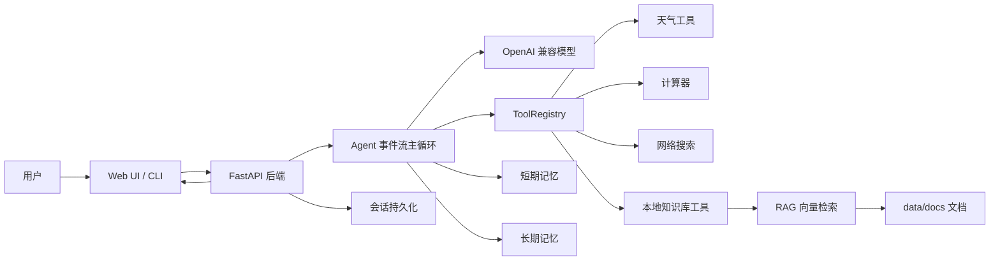

# 架构说明

本文档说明智能多工具助手的核心架构、运行链路和模块边界，方便后续维护与扩展。

## 总体架构

系统由四层组成：

- **交互层**：`frontend/index.html` 和 `main.py` 提供 Web / CLI 两种入口。
- **服务层**：`server.py` 提供 FastAPI 接口、SSE 流式响应、文档上传和会话管理。
- **智能体层**：`agent.py` 编排模型调用、工具调用、RAG 预检索、记忆注入和事件输出。
- **能力层**：`tools/`、`memory/`、`rag/` 分别提供工具、记忆和知识库检索能力。

## 对话链路

1. 用户通过 Web 或 CLI 发送消息。
2. 后端根据 `session_id` 获取或创建 Agent。
3. Agent 将短期记忆、长期记忆和必要的系统指令组装成模型上下文。
4. 如果问题命中本地知识库语义，Agent 会先调用 `knowledge_base` 预检索。
5. 模型按 OpenAI function calling 协议决定是否调用工具。
6. `ToolRegistry` 根据工具名分发到对应 `run()` 方法。
7. 工具结果回填给模型，模型生成最终回复。
8. 后端通过 SSE 将 token、tool_call、sources、done 等事件持续推给前端。
9. 本轮完成后，会话快照写入 `data/conversations/`，长期记忆按需写入 `data/memory_store.json`。

## 工具系统

所有工具继承 `tools.base.Tool`，通过以下字段描述给模型：

- `name`：function calling 中的唯一工具名。
- `description`：模型选择工具时读取的触发条件说明。
- `parameters`：JSON Schema 参数定义。
- `run()`：真实执行逻辑。
- `is_available()`：能力开关，不可用工具会从模型工具列表中隐藏。

当前内置工具：

| 工具 | 作用 | 降级策略 |
|---|---|---|
| `get_weather` | 查询城市天气 | 使用内置示例数据 |
| `calculator` | 安全计算数学表达式 | AST 白名单解析，非法表达式返回错误说明 |
| `web_search` | 查询网络搜索结果 | 未配置 API Key 或请求失败时返回示例结果 |
| `knowledge_base` | 检索本地知识库 | 向量库为空时自动隐藏 |

## 记忆系统

记忆系统分为短期记忆和长期记忆：

- **短期记忆**：维护当前会话上下文。当历史消息超过上限时，较早对话会被压缩为滚动摘要，只保留近期原文。
- **长期记忆**：跨会话保存用户稳定事实和偏好。写入时通过 LLM 抽取事实，读取时采用向量召回加关键词兜底，并支持用户主动删除或更新记忆。

多会话持久化由 `memory/conversation_store.py` 负责，每个会话保存为一个 JSON 文件。长期记忆按 `USER_ID` 保存，因此多个会话窗口共享同一份用户画像。

## RAG 知识库

RAG 链路分为入库和检索两个阶段：

1. 启动时 `rag.ingest.ingest_dir()` 读取 `data/docs/` 下的 `.md` / `.txt` 文件。
2. `chunk_text()` 将文档切分为带重叠的小块。
3. `LLMClient.embed()` 将文本块转为向量；远程 embedding 不可用时可使用本地哈希向量兜底。
4. `rag.vector_store.STORE` 保存文本、向量和来源元数据。
5. 用户提问时，`KnowledgeBaseTool` 对问题做 embedding，并按余弦相似度检索相关块。
6. 命中片段被拼入上下文，来源通过 `last_sources` 传给前端仪表栏。

知识库相关问题会被强约束为“只能依据检索结果回答”。如果资料未覆盖问题，系统会明确返回“知识库未提及”，降低幻觉风险。

## 流式事件

`agent.chat_stream()` 是项目的事件流核心，主要事件包括：

| 事件 | 说明 |
|---|---|
| `tool_call` | 模型调用了某个工具，前端可展示工具名和参数 |
| `token` | 助手回复的增量文本 |
| `sources` | RAG 或搜索工具提供的引用来源 |
| `done` | 本轮对话结束，可触发会话落盘 |
| `error` | 流式处理中的异常信息 |

这种事件模型让后端可以同时支持 CLI、Web UI 和未来可能的其他客户端。

## 可扩展方向

- 接入真实天气、日历、邮件、数据库等外部工具。
- 将内存向量库替换为持久化向量数据库。
- 对 RAG 检索增加 rerank、多路召回和更严格的置信度判断。
- 增加用户认证，实现多用户隔离。
- 将前端拆分为独立工程，提高复杂交互下的可维护性。
